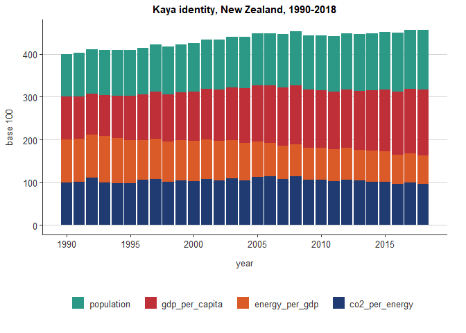

# mfePubs 

`mfePubs` is a package for homogenising the graphical outputs of code
based analysis at MfE.

## Installation

``` r
# mfePubs is under development, so it is not available on CRAN
# and needs to be installed from github
# install.packages("devtools")
devtools::install_github("MarionaMFE/mfe_pubs")
```

## Contents

The package contains the following functions and templates:

1- `er template report`: MfE’s Markdown/Word template

2- `mfe_theme()`: Function to set ggplot themes to MfE standard

3- `scale_colour_mfe` and `scale_fill_mfe`: Functions to apply MfE
branded color palettes to discrete variables in ggplot graphs.

4- `format_num()`: Function to standarise the format of numbers;
(decimal places, thousands marks)

5- `macron()`: Function that makes sure macrons are properly displayed
in graphs.

When you have downloaded the package and successfully installed it you
are good to go and write MfE word documents in R Markdown and create
charts with MfE themes and colors, including the display of Macrons in
Te Reo.

## Usage

### Functions

#### Clean the data before plotting and prepare it for ggplot

``` r

library(mfePubs)

library(tidyverse)
library(reshape2)
library(tidyverse)
library(lubridate)

# load the kaya dataset attached with mfePubs package
data(kaya)

# tidy data (transpose it)
kaya %>% 
  rownames_to_column %>%
  gather(variable, value, -rowname) %>%
  spread(rowname, value) -> spread_table

# change variable names
names(spread_table) <- c('year', 'population', 'gdp_per_capita', 'co2', 'energy_per_gdp', 'co2_per_energy')

# remove first line and make 'year' a numeric variable
spread_table %>% 
  filter(year != 'X') %>%
  mutate(year = as.numeric(str_remove(year, 'X'))) %>%
  select (-co2) -> spread_table

data_long <- melt(spread_table, id = 'year')
```

### `theme_mfe()`

A basic explanation and summary here:

`theme_mfe()`: has is added to the ggplot chain after you have created a
plot. What it does is generally makes text size, font and colour, axis
lines, axis text and many other standard chart components into MfE
style, which right now is pretty much a copy of Stats NZ’s [`simplevis`
package](https://github.com/StatisticsNZ/simplevis).

The function is pretty basic and does not change or adapt based on the
type of chart you are making, so in some cases you will need to make
additional theme arguments in your ggplot chain if you want to make any
additions or changes to the style, for example to add or remove
gridlines etc. Also note that colours for lines in the case of a line
chart or bars for a bar chart, do not come out of the box from the
theme\_mfe() function, but need to be explicitly set in your other
standard ggplot chart functions.

`theme_mfe()` has two optional arguments: `horizontal_axis` which
defaults to FALSE, and `bottom_legend` which defaults to TRUE.

Example of how the function and its arguments are used in a standard
workflow:

``` r

kayaplot <- ggplot(data_long, aes(x = year, y = as.numeric(value), colour = variable)) +
  geom_line(size = 1.5) +
  ggtitle('Kaya identity, New Zealand, 1990-2018') +
  ylab('base 100') +
  xlab('year') +
  scale_x_continuous(n.breaks=length(unique(data_long$year))/5)

kayaplot
```

<!-- -->

This is what the ggplot default theme looks like. Now to apply the MfE
style just need to add the function call:

``` r

kayaplot + theme_mfe() 
```

<!-- -->

Let’s say we want the x axis labels to display horizontally

``` r

kayaplot + theme_mfe(horizontal_axis = TRUE)
```

<!-- -->

Or we might want the legend to display in the right hand side instead

``` r
kayaplot + theme_mfe(bottom_legend = FALSE)
```

<!-- -->

For any other custom made modifications of the theme, just specify them
*after* the theme\_mfe() call. If you specify them before, they’ll be
overwritten by theme\_mfe()

``` r
kayaplot +
  theme_mfe(horizontal_axis = TRUE, bottom_legend = FALSE) +
  theme(axis.text.x = element_text(face="bold", color="#993333", 
                           size=14, angle=45),
          axis.text.y = element_text(face="bold", color="#993333", 
                           size=14, angle=45))
```

<!-- -->

### `scale_color_mfe()`

To continue with the kaya plot example, we could add MfE branded
colours. The function `scale_color_mfe()` can do that in one line of
code:

``` r
kayaplot + 
  theme_mfe() +
  scale_colour_mfe(direction = -1)
```

<!-- -->

### `scale_fill_mfe()`

``` r

kaya_barplot <- ggplot(data_long, aes(x = year, y = as.numeric(value), fill = variable)) +
  geom_col() +
  ggtitle('Kaya identity, New Zealand, 1990-2018') +
  ylab('base 100') +
  xlab('year') +
  scale_x_continuous(n.breaks=length(unique(data_long$year))/5) +
  theme_mfe(horizontal_axis = TRUE) +
  scale_fill_mfe(direction = -1)

kaya_barplot
```

<!-- -->

The MfE colours can be used in the functions
`ggplot2::scale_color_manual`and `ggplot2::scale_fill_manual` and they
can be accessed by their names:

``` r
mfe_colours
#> $light_blue
#> [1] "#32809C"
#> 
#> $blue
#> [1] "#1B556B"
#> 
#> $light_green
#> [1] "#2C9986"
#> 
#> $red
#> [1] "#BF2F37"
#> 
#> $orange
#> [1] "#DA5A28"
#> 
#> $metallic_blue
#> [1] "#1F3B71"

image(volcano, col = unname(unlist(mfe_colours)))
```

<!-- -->

``` r


kaya_barplot_custom <- ggplot(data_long, aes(x = year, y = as.numeric(value), fill = variable)) +
  geom_col() +
  ggtitle('Kaya identity, New Zealand, 1990-2018') +
  ylab('base 100') +
  xlab('year') +
  scale_x_continuous(n.breaks=length(unique(data_long$year))/5) +
  theme_mfe() +
  scale_fill_manual(values = c(mfe_colours$light_green, 
                               mfe_colours$red, 
                               mfe_colours$orange, 
                               mfe_colours$metallic_blue))

kaya_barplot_custom
```

<!-- -->

### `MfE's Word template report`

This template is an RMarkdown template that replicates the format and
style from the MfE word template. The template is made available with
package installation. To access the template follow the steps:

1- From RStudio File/ New File/ R Markdown / From Template


2- Detailed instructions about the template can be found
[here](https://github.com/mfe-nz/ER_template_markdown)

### `format_num()`

The function format\_num() is for homogenising the format of the
numbers, for example, to ensure all the numbers within an R Markdown
document follow the same rules of decimal positions and markers.

``` r
format_num(156346831441)
#> [1] "156,346,831,441.00"
format_num(15)
#> [1] "15.00"
format_num(0.0000000005)
#> [1] "0.00"
format_num(0.2)
#> [1] "0.20"
```

### `mac()`

This function provides help in using m within R code/text. `{r
format_num(564654)}`
